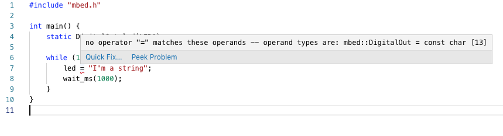

# Generate VSCode intellisense for Mbed OS

The Visual Studio Code exporter in Mbed OS is buggy. This project generates correct `c_cpp_properties.json`, `task.json` and `launch.json` files for Mbed OS projects. The tool is non-destructive, and will only overwrite relevant sections of your VSCode configuration.

**Note:** This tool invokes the `make_gcc_arm` exporter through Mbed CLI, which overwrites the `Makefile`, `mbed_config.h` and `GettingStarted.html` files in your project. Remove these files to run the tool.

## Examples

Enforces method signatures:



Shows correct include paths:


Inline function documentation:


Aware of the current target:


Sets up debugging for both PyOCD and STLink targets:


## Usage

1. Install [Node.js 10](https://nodejs.org/en/) or higher.
1. Install this tool:

    ```
    $ npm install mbed-vscode-generator -g
    ```

1. Run the tool from an Mbed OS project:

    ```
    $ mbed-vscode-generator -m DISCO_L475VG_IOT01A
    ```

    You can set the input and output directories through `-i` and `-o`.

You'll need to re-run this tool every time a change might occur in your include path list or in your define list. For example:

* When adding a new library.
* When changing values in `mbed_app.json`.
* When updating Mbed OS.

Only the parts of your `c_cpp_properties.json` file that need to change will be overwritten.

## Debugger

A launch and debug configuration is automatically created. You can either debug through [pyOCD](https://github.com/mbedmicro/pyOCD) (should work for most targets), or through `stutil` (for STLink targets) ([Install instructions for macOS](http://macappstore.org/stlink/)).

pyOCD is used as default. To use STLink instead:

```
$ mbed-vscode-generator -m DISCO_L475VG_IOT01A --debugger stlink
```

## Troubleshooting

### Exporting to make_gcc_arm failed

This tool relies on the `make_gcc_arm` exporter, which can be broken [for Mbed 2 projects](https://github.com/ARMmbed/mbed-os/issues/8415#issuecomment-503193777). Report a bug in the [Mbed OS project](https://github.com/ARMmbed/mbed-os/issues). Switching to an Mbed OS 5 project (e.g. [mbed-os-example-blinky](https://github.com/ARMmbed/mbed-os-example-blinky)) typically helps.
